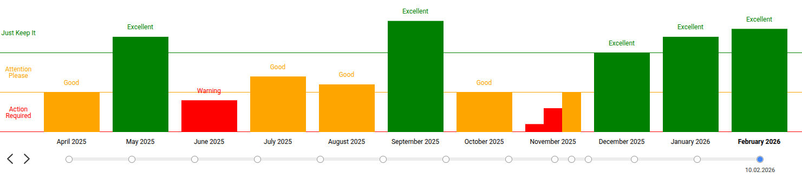

## @evrone-erp/bar-chart
Библиотека содержит компонент, позволяющий рисовать столбчатый график подобного вида:



В основе лежат библиотеки `@visx`

## Использование

1. Установите пакет `yarn add @evrone-erp/bar-chart`.
2. Импортируйте компонент и передайте ему все необходимые свойства
```react
import { BarChart } from '@evrone-erp/bar-chart';
import React from 'react';

export default () => (
  <BarChart
    dataParams={[
      {
        value: 4,
        color: 'red',
        label: 'Warning',
      },
      {
        value: 9,
        color: 'orange',
        label: 'Good',
      },
      {
        value: 15,
        color: 'green',
        label: 'Excellent',
      },
    ]}
    width={500}
    height={500}
    data={[
      {
        values: [
          {
            header: '03.03.2025',
            value: 2,
          },
        ],
        label: 'March 2025',
      },
      {
        values: [
          {
            header: '03.04.2025',
            value: 5,
          },
        ],
        label: 'April 2025',
      },
      {
        values: [
          {
            header: '05.05.2025',
            value: 12,
          },
        ],
        label: 'May 2025',
      },
      {
        values: [
          {
            header: '07.06.2025',
            value: 4,
          },
        ],
        label: 'June 2025',
      },
      {
        values: [
          {
            header: '10.07.2025',
            value: 7,
          },
        ],
        label: 'July 2025',
      },
      {
        values: [
          {
            header: '11.08.2025',
            value: 6,
          },
        ],
        label: 'August 2025',
      },
      {
        values: [
          {
            header: '10.09.2025',
            value: 14,
          },
        ],
        label: 'September 2025',
      },
      {
        values: [
          {
            header: '10.10.2025',
            value: 5,
          },
        ],
        label: 'October 2025',
      },
      {
        values: [
          {
            header: '10.11.2025',
            value: 1,
          },
          {
            header: '18.11.2025',
            value: 3,
          },
          {
            header: '29.11.2025',
            value: 5,
          },
        ],
        label: 'November 2025',
      },
      {
        values: [
          {
            header: '10.12.2025',
            value: 10,
          },
        ],
        label: 'December 2025',
      },
      {
        values: [
          {
            header: '10.01.2026',
            value: 12,
          },
        ],
        label: 'January 2026',
      },
      {
        values: [
          {
            header: '10.02.2026',
            value: 13,
          },
        ],
        label: 'February 2026',
      },
    ]}
    categories={[
      {
        label: 'Action Required',
        color: 'red',
        lineColor: 'red',
        maxValue: 5,
      },
      {
        label: 'Attention Please',
        color: 'orange',
        lineColor: 'orange',
        maxValue: 10,
      },
      {
        label: 'Just Keep It',
        color: 'green',
        lineColor: 'green',
        maxValue: 15,
      },
    ]}
  />
);
```

[](https://evrone.com/?utm_source=github&utm_medium=evrone-erp-bar-chart)
